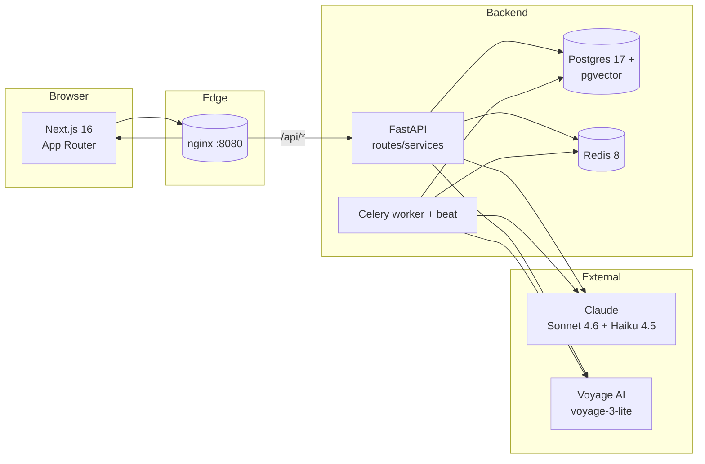

# EverCurrent — Architecture

## System overview



Only nginx is exposed to the host. Service-to-service traffic stays
inside the docker network.

## Layer boundaries

```
┌─────────────────────────────────────────────┐
│ apps/web (Next.js App Router)               │
│   - server components fetch via /api/*      │
│   - TanStack Query for client state         │
│   - Zustand for impersonation               │
│   - SSE for the agent chat                  │
├─────────────────────────────────────────────┤
│ apps/api FastAPI routes                     │
│   - Pydantic request/response schemas       │
│   - DI via Depends() (session,             │
│     current user id from header)            │
├─────────────────────────────────────────────┤
│ Domain services                             │
│   ingestion · enrichment · scoring ·        │
│   digest · decisions · rag · agent          │
│   Pure Python where possible; LLM at edges. │
├─────────────────────────────────────────────┤
│ Repositories (db/repositories/*)            │
│   - take + return Pydantic domain models    │
│   - never leak SQLAlchemy rows              │
├─────────────────────────────────────────────┤
│ SQLAlchemy 2.0 async ORM (db/models.py)     │
│   - one declarative class per table         │
│   - explicit eager-load relationships       │
├─────────────────────────────────────────────┤
│ Postgres 17 + pgvector 0.8                  │
└─────────────────────────────────────────────┘
```

## Data flow — daily pipeline

```mermaid
flowchart TB
    A[Seed: project + users + channels<br/>+ committed messages + docs]
        --> B[enrich_day(day=N)<br/>Claude Haiku tagger]
    B --> C[extract_decisions_for_day(N)<br/>Claude Sonnet]
    C --> D[score_messages_for_user<br/>pure Python]
    D --> E[generate_all_digests_for_day(N)<br/>Claude Sonnet]
    E --> F[(digests table)]
    C --> G[(cards table)]
    B --> H[(message_tags table)]
```

All three LLM hops are idempotent at the database boundary:
`enrich_day` skips messages with existing tags; decisions are
re-extracted on every refresh tick (dedup is left to the prompt +
confidence cutoff for now — production would hash-dedup against
existing rows); digests use `UNIQUE (user_id, day, phase)` so
re-runs replace cleanly.

## Agent (backend-only)

`POST /api/agent/chat` still serves Sonnet tool-use over SSE — six
tools (`search_messages`, `get_thread_context`, `get_user_context`,
`get_project_state`, `search_documents`, `query_decisions`) over the
project's own data. The frontend doesn't surface a chat panel
anymore (removed from the dashboard); the endpoint is kept for
backend integrations (e.g., Slack slash command, internal tooling).

The runner appends each assistant tool-use turn AND the corresponding
`tool_result` message to the conversation, so the model sees its own
intermediate calls. Streaming is the default; `text_delta`,
`tool_use_start`, `tool_use_result` events flow back to the consumer.

## Design decisions

**Why Celery + Celery Beat?** Battle-tested, broad operational
toolchain (Flower, monitoring, retries, routing), and well-understood
at scale. Tasks are sync wrappers that call `asyncio.run(...)` on
existing async business logic — Celery handles concurrency via a
fork pool while our DB / LLM / Redis calls stay async. Beat fires
sub-minute schedules via `schedule(run_every=30.0)`. Redis serves
both as the broker and as the SSE pub/sub bus.

**Why Voyage, not OpenAI embeddings?** Anthropic recommends Voyage in
its docs; `voyage-3-lite` at 512 dims is fast and cheap. Free tier is
3 RPM which we hit on the seed indexing; a payment method lifts that to
the standard tier. The `EmbeddingProvider` interface keeps the swap
clean.

**Why Haiku for tagging, Sonnet for everything else?** Tagging is a
bounded, repetitive task: per-message topic + urgency + role +
entities. Haiku is fast and ~10× cheaper. Digest, decision, agent and
doc generation need reasoning quality and instruction-following, so
they get Sonnet.

**Why server components by default in Next.js?** Initial paint comes
straight from the server (digest renders without a client roundtrip);
client components light up only where interactivity is required (chat,
buttons, dropdowns). Shrinks JS payload and avoids client-side data
fetching for the digest path.

**Why pure-Python scoring?** Predictable, cheap, testable. Phase
transitions reshuffle digests via a deterministic rule rather than an
LLM call — same data, different `current_phase` flips the digest
priorities in milliseconds. The `scoring/engine.py` function is a pure
mapping from `(EnrichedMessage[], User, Project) -> ScoredMessage[]`
which the eval harness can exercise without LLM cost.

**Why a heuristic tagger fallback?** API keys are optional for the
take-home reviewer. With `ANTHROPIC_API_KEY` unset, `enrich_day` falls
back to a keyword-driven tagger that emits the same `MessageTagPayload`
shape. The rest of the pipeline (scoring, digest heuristic, decisions
skipped) continues to work end-to-end. Same applies to the digest
generator's heuristic markdown fallback.

## File layout

See `apps/api/src/evercurrent/` and `apps/web/`. Per-directory READMEs
sit alongside the code.
