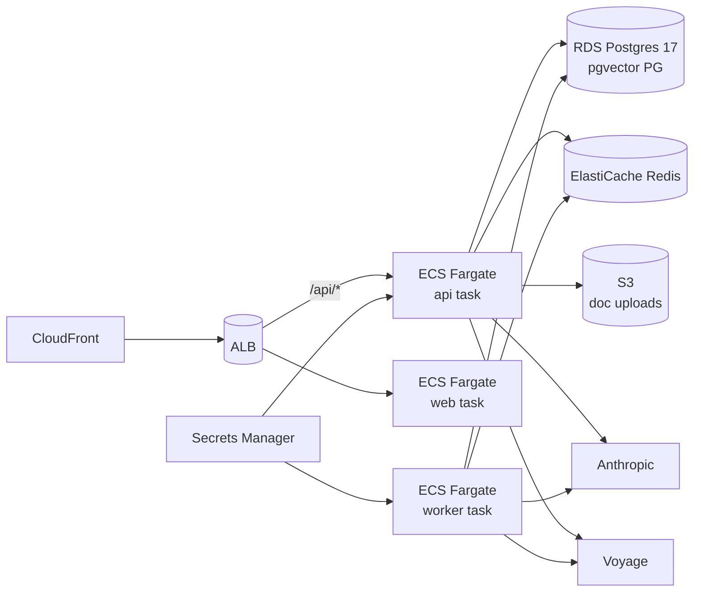

# EverCurrent — Production Roadmap

This document maps the take-home prototype to a production system.

## What ships today

- Single-tenant hardware project (Warehouse Robot v2 seeded) with 8
  synthetic users, 5 channels, 5 days of pre-generated messages
  (~42 total), 5 project documents.
- Enrichment pipeline: Haiku tagger with heuristic fallback.
- Scoring engine: pure-Python, role + cross-functional + urgency +
  phase + per-user learned weights.
- Digest generator: Sonnet with heuristic fallback.
- Decision extractor: Sonnet, confidence thresholds, status downgrade.
- RAG: pgvector with HNSW + cosine, voyage-3-lite embeddings, markdown
  chunker preserving section paths.
- Agent: 6-tool Sonnet runner with SSE streaming to a Next.js chat
  panel.
- Docker compose stack: postgres, redis, api, worker, web, nginx.
- Quality gates: ruff + ty + eslint + prettier + tsc in CI.
- Eval harness: scoring scenarios + determinism checks.

## Real Slack / Teams integration

- `IngestionAdapter` interface with a `SlackAdapter` and a
  `SyntheticAdapter` (today's seed loader).
- OAuth installation flow → store per-workspace bot tokens encrypted at
  rest (AWS KMS or Vault).
- Slack Events API webhook receiver: `message.channels`, `reactions`,
  `app_mention`. Inbound queue + idempotency key (`team_id:ts:channel`)
  so retries don't double-write.
- Rate limit per workspace (Slack tier 3 = 50 req/min). Sliding-window
  token-bucket in Redis.
- Backfill mode: paginate channel history with `conversations.history`,
  resume from `latest` cursor.
- Outbound (replies / DMs): respect `chat.postMessage` quotas;
  exponential backoff with retry-after header.

## Behavioural signals

- Per-user `interactions` table: opened_digest, clicked_item,
  thumbs_up/down, dwell_seconds, search_query.
- Weights become a learned vector instead of a per-topic scalar.
  Train a logistic ranker offline weekly; ship coefficients to
  `scoring/weights.py` via config push.
- Thompson sampling for "explore" slot — every digest carries one item
  outside the user's expected interests so the model gets signal on
  what's actually surprising.

## Multi-tenancy + auth

- Tenant model: `Org → Project → Channel → User`. Row-level RLS in
  Postgres keyed on `org_id`. Every repository takes an `OrgScope`
  context.
- Auth: SSO via Auth0 / Clerk / Cognito. SCIM provisioning for
  enterprise.
- RBAC: roles `viewer / contributor / admin / oncall`. Tool access in
  the agent gated by role (e.g. `query_decisions` is admin-only in
  some tenants).
- Audit log: every LLM call, every feedback, every phase change
  recorded with actor, before/after, request_id.

## Observability

- Structlog + OpenTelemetry already wired (lifespan configures
  structlog). Production exporter: OTLP → Grafana Cloud / Honeycomb.
- LLM-specific spans on every Anthropic call: `evercurrent.llm.model`,
  `tokens_in`, `tokens_out`, `latency_ms`, `cache_hit`, `prompt_hash`.
- RAG spans: `evercurrent.rag.similarity_max`, `chunks_scanned`,
  `top_k`. Alert when `similarity_max < 0.4` rate > 5%.
- Cost dashboard: per-tenant $/day broken down by Haiku tagging,
  Sonnet digest, Sonnet decisions, Sonnet agent.
- Eval regression alerts: nightly job runs `make eval`, compares
  against the prior 7 days, posts to Slack if any metric drops > 10%.

## Scaling

- Postgres becomes the bottleneck around 5M messages per project. At
  that point: partition `messages` and `message_tags` by `project_id +
  day`, hot/cold archive cold partitions to S3 + Iceberg.
- Vector index: HNSW scales to a few million chunks. Beyond that, swap
  pgvector for Qdrant or a managed vector DB and keep the
  `EmbeddingProvider` adapter pattern in place.
- Worker fan-out: Celery scales horizontally; for tens of QPS migrate to
  Temporal — durable workflows + retries + heartbeats are first-class
  there, and the activity API maps cleanly to our task functions.
- Embeddings: when `voyage-3-lite` becomes a cost line item, fine-tune
  a domain-specific model on collected (query, accepted chunk) pairs.
  The interface stays the same.

## RAG evolution

- Structural chunking: today we split markdown by header. Production
  should split on semantic boundaries (sentence-transformer
  segmenter), preserve tables as JSON, treat code blocks as
  single-chunk atomically.
- Hybrid search: BM25 (Postgres `tsvector` already in the schema for
  messages) + dense vector + RRF re-rank. Cross-encoder re-ranker on
  the top 25.
- HyDE query expansion: ask Sonnet to write the answer it expects,
  embed THAT, retrieve against it. Often beats embedding the raw
  question.
- Eval set growth: every (question, accepted_chunk, rejected_chunk)
  feedback tuple gets logged. The eval set becomes self-curating.

## ML / personalisation

- Today: rule + per-topic feedback weights.
- v1.5: learned ranker over the rule features (logistic regression,
  weekly retrain).
- v2: per-user residual model. The base ranker is shared across the
  org; a small per-user model corrects for individual preferences.
- A/B testing: feature flag per scoring weight, per prompt. Sample
  10% of digests through alternative weights; compare 30-day
  engagement.

## Cost optimisation

- Prompt caching: pin the system prompt + tool definitions; warm cache
  on every Sonnet agent turn (Claude API supports this).
- Tagging is the biggest volume — batch 30+ messages per Haiku call.
- Digest summaries can fall back to the heuristic generator for free
  users; Sonnet generation reserved for paid tier.
- Pre-compute embeddings on document upload; embed queries with a
  cheaper Voyage tier and re-rank the top-25 with the full model.

## Compliance + security

- ITAR / export-controlled data: tenant flag forbids leaving the
  EU/US tenancy region. Anthropic supports regional endpoints.
- SOC 2: audit log retention 1 year, encryption at rest (AES-256 via
  RDS / EBS), encryption in transit (TLS 1.3), access reviews.
- PII handling: extract redaction step before any LLM call (PII
  detector → mask names/emails). Re-attach after the model returns.

## AWS deployment

- ECS Fargate for api / worker / web (auto-scaling on CPU and queue
  depth). One task per AZ minimum.
- RDS Postgres 17 with `shared_preload_libraries=pg_stat_statements,
  pgvector`. Reserved instance for prod, on-demand for staging.
- ElastiCache Redis cluster mode disabled (small enough); enable
  cluster mode for >1M ops/s.
- Secrets Manager for API keys; rotate every 90 days.
- ALB with sticky sessions for SSE long-lived connections OR migrate
  agent stream to WebSocket.
- CloudFront in front of the web ALB for static + cache invalidation
  on deploy.

## Reliability

- Chaos testing: kill a worker mid-job; verify Celery retries via task_default_retry_delay + max_retries. Kill
  postgres for 30s; verify api returns 503 with retry-after, doesn't
  crash.
- Degraded mode: agent falls back to heuristic answers if Anthropic
  is unreachable. Digest falls back to heuristic markdown if Sonnet
  fails. Scoring keeps working regardless.
- Idempotency keys on every Celery task. `(project_id, day, task_name)`
  prevents double-enrichment.

## What I would build next, in order

1. Prompt caching on Sonnet agent turns — biggest cost lever.
2. Per-document hash so re-indexing skips unchanged docs.
3. A real Slack adapter so we stop running on synthetic data.
4. RAG eval set with 12+ Q/A pairs to baseline P@5.
5. Behavioural signal capture (click + dwell) — needed to train the
   ranker.

## What ships next post-take-home

The phased list below is roughly two-week chunks each. Order picked so
each lands a visible product feature and each builds on the previous.

### 1. Linker agent + cross-source edges (week 1)

A Sonnet agent that runs per new Card. Calls `search_documents`,
`search_messages`, `query_decisions` to find semantic neighbours.
Persists `(from, to, edge_type, confidence)` rows. Unlocks the
"impact preview" sidebar on every Card. Phase doc already exists at
`docs/phases/PHASE_*` (deferred from take-home scope).

### 2. Chat agent on the dashboard (weeks 2-3)

Open-question Q+A over the org's data. Tools: `search_documents`,
`search_messages`, `query_decisions`, `query_cards`,
`get_user_context`, `get_thread_context`. Streamed answer, inline
tool-call inspector, per-user transcript persistence, citation
rendering. The deferral reason is in `docs/DECISIONS.md` ADR-008 —
Router + Digest prove the agentic thesis; Chat adds another ~3 days
of UI + retrieval re-rank work.

### 3. Timeline / Gantt + critical-path what-if (week 4)

Horizontal bands for phases, diamonds for milestones, dots for
decisions plotted at `decided_at`. Arrows from agent-inferred
dependencies. Drag a milestone -> live SSE recompute via the
existing `impact/critical_path.py` topological sort. Pure visual
addition; backend data is already there.

### 4. AWS deploy (week 5)

The architecture diagram in §"AWS deployment" above is the spec.
ECS Fargate for api/worker/web, RDS Postgres 17 with pgvector,
ElastiCache Redis, Secrets Manager, ALB sticky sessions for SSE.
First production org gets `region=us-east`, `itar=false`. Real Slack
app review + Drive verification happen during this phase.

### 5. GitHub + Jira + Email connectors (weeks 6-7)

Each is a new module under `connectors/` implementing the same
Protocol: `oauth_url`, `oauth_callback`, `backfill`, `webhook_handler`,
`pull_latest`. GitHub webhook is PR events. Jira is issue events.
Email is per-user Gmail OAuth with opt-in. Per source, ~2 days of
work; the shape is locked.

### 6. Phase agent ("ready for DVT exit?") + Personalizer (week 8)

The Phase agent reads open decisions + risks for the active phase,
judges whether the gate criteria are met, lists the gap. Sonnet,
tool-using, runs on demand from the dashboard.

The Personalizer is a weekly cron Sonnet pass over a user's feedback
log (thumbs up/down on digest items, dwell, ignored). Rewrites the
`topic_weights` per-user. Pure ranking model; no UI change.

### 7. The post-MVP polish — chat history, audit page, weekly summary

- Chat answer transcripts persisted, searchable.
- Audit page exposing the `audit_log` rows: every LLM call, every
  ingest event, every notification sent. Searchable, exportable for
  SOC 2.
- Weekly Sunday-evening email digest as the cheaper fallback channel.

After this list the "agent product" becomes the "agent platform" —
every new connector or screen ships against the same infra.
